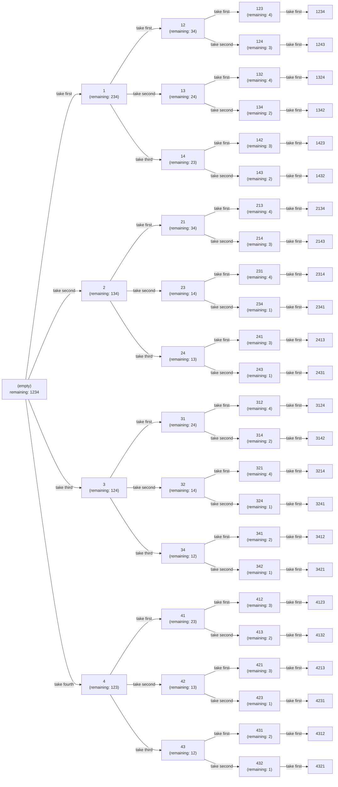

```mermaid
graph LR
a0["(empty)<br>remaining: 1234"]
a1["1<br>(remaining: 234)"]
a2["2<br>(remaining: 134)"]
a3["3<br>(remaining: 124)"]
a4["4<br>(remaining: 123)"]
a12["12<br>(remaining: 34)"]
a13["13<br>(remaining: 24)"]
a14["14<br>(remaining: 23)"]
a21["21<br>(remaining: 34)"]
a23["23<br>(remaining: 14)"]
a24["24<br>(remaining: 13)"]
a31["31<br>(remaining: 24)"]
a32["32<br>(remaining: 14)"]
a34["34<br>(remaining: 12)"]
a41["41<br>(remaining: 23)"]
a42["42<br>(remaining: 13)"]
a43["43<br>(remaining: 12)"]
a123["123<br>(remaining: 4)"]
a124["124<br>(remaining: 3)"]
a132["132<br>(remaining: 4)"]
a134["134<br>(remaining: 2)"]
a142["142<br>(remaining: 3)"]
a143["143<br>(remaining: 2)"]
a213["213<br>(remaining: 4)"]
a214["214<br>(remaining: 3)"]
a231["231<br>(remaining: 4)"]
a234["234<br>(remaining: 1)"]
a241["241<br>(remaining: 3)"]
a243["243<br>(remaining: 1)"]
a312["312<br>(remaining: 4)"]
a314["314<br>(remaining: 2)"]
a321["321<br>(remaining: 4)"]
a324["324<br>(remaining: 1)"]
a341["341<br>(remaining: 2)"]
a342["342<br>(remaining: 1)"]
a412["412<br>(remaining: 3)"]
a413["413<br>(remaining: 2)"]
a421["421<br>(remaining: 3)"]
a423["423<br>(remaining: 1)"]
a431["431<br>(remaining: 2)"]
a432["432<br>(remaining: 1)"]
a1234["1234"]
a1243["1243"]
a1324["1324"]
a1342["1342"]
a1423["1423"]
a1432["1432"]
a2134["2134"]
a2143["2143"]
a2314["2314"]
a2341["2341"]
a2413["2413"]
a2431["2431"]
a3124["3124"]
a3142["3142"]
a3214["3214"]
a3241["3241"]
a3412["3412"]
a3421["3421"]
a4123["4123"]
a4132["4132"]
a4213["4213"]
a4231["4231"]
a4312["4312"]
a4321["4321"]

a0 --take first--> a1
a0 --take second--> a2
a0 --take third--> a3
a0 --take fourth--> a4
a1 --take first--> a12
a1 --take second--> a13
a1 --take third--> a14
a2 --take first--> a21
a2 --take second--> a23
a2 --take third--> a24
a3 --take first--> a31
a3 --take second--> a32
a3 --take third--> a34
a4 --take first--> a41
a4 --take second--> a42
a4 --take third--> a43
a12 --take first--> a123
a12 --take second--> a124
a13 --take first--> a132
a13 --take second--> a134
a14 --take first--> a142
a14 --take second--> a143
a21 --take first--> a213
a21 --take second--> a214
a23 --take first--> a231
a23 --take second--> a234
a24 --take first--> a241
a24 --take second--> a243
a31 --take first--> a312
a31 --take second--> a314
a32 --take first--> a321
a32 --take second--> a324
a34 --take first--> a341
a34 --take second--> a342
a41 --take first--> a412
a41 --take second--> a413
a42 --take first--> a421
a42 --take second--> a423
a43 --take first--> a431
a43 --take second--> a432
a123 --take first--> a1234
a124 --take first--> a1243
a132 --take first--> a1324
a134 --take first--> a1342
a142 --take first--> a1423
a143 --take first--> a1432
a213 --take first--> a2134
a214 --take first--> a2143
a231 --take first--> a2314
a234 --take first--> a2341
a241 --take first--> a2413
a243 --take first--> a2431
a312 --take first--> a3124
a314 --take first--> a3142
a321 --take first--> a3214
a324 --take first--> a3241
a341 --take first--> a3412
a342 --take first--> a3421
a412 --take first--> a4123
a413 --take first--> a4132
a421 --take first--> a4213
a423 --take first--> a4231
a431 --take first--> a4312
a432 --take first--> a4321
```
